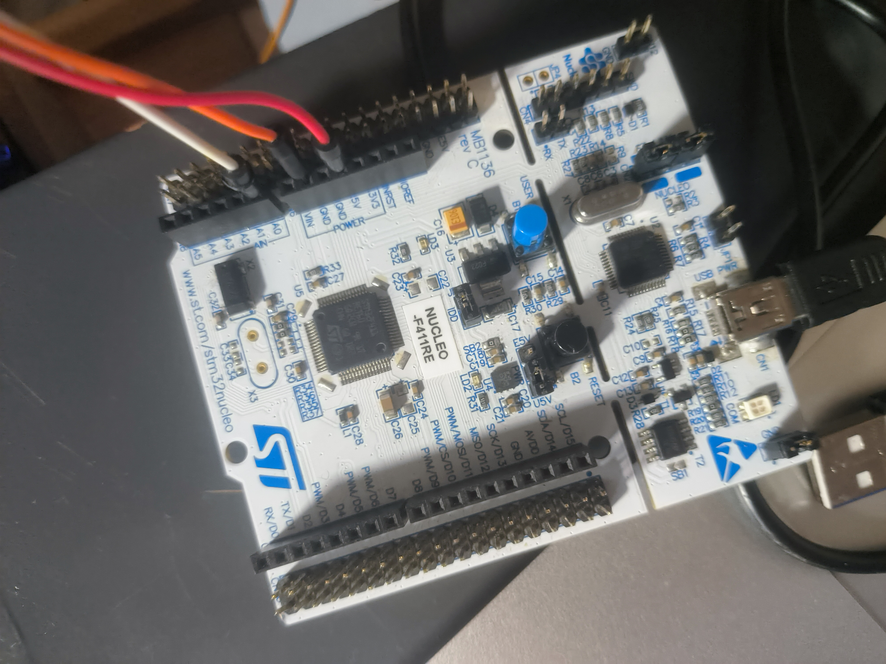

## 本 ***project*** 使用 ***stm32f411re nucleo*** 板子作为硬件平台进行实验
### 1.目录介绍
#### 本项目采用 ***CUBE MX*** 生成，并在 ***keil*** 环境下进行开发
> keil 工程在 MDK-ARM 文件夹下 
>
> 源码在 Core 文件夹下
>
>asset下是一些静态文件
### 2.功能介绍
#### 2.1本项目实现了1000Hz定时器中断和周期为20ms用于驱动舵机的2路pwm
#### 2.2本项目还采用了dma和串口空闲中断来接收不定长度的数据
#### 2.3并且用于下载的mini USB也可以作为串口2来使用
> 接线图如下

